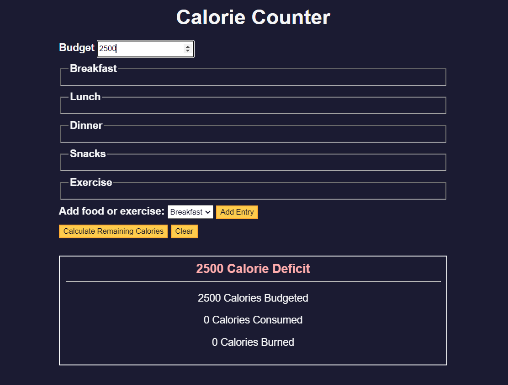

# Calorie Counter Application

## Overview
The Calorie Counter is a user-friendly web application designed to help users track their daily calorie intake and expenditure. It allows for the addition of multiple food entries for breakfast, lunch, dinner, and snacks, as well as the calories burned through exercise.

## Features
- **Dynamic Entry System:** Add multiple entries for different meals and exercises.
- **Calorie Budget:** Set a daily calorie budget to compare against your consumption and exercise.
- **Real-Time Calculation:** Calculates total calories consumed, burned, and the remaining budget in real-time.
- **Input Validation:** Ensures that the calorie counts entered are valid numbers.
- **Clear Data:** Allows users to clear all input fields and start fresh.

## How to Use
1. **Set Calorie Budget:** Enter your daily calorie budget in the 'Budget' field.
2. **Add Entries:** Use the dropdown menu to select a meal or exercise. Click 'Add Entry' to add fields for the item's name and calorie count.
3. **Input Data:** Enter the name and calorie count for each item.
4. **Calculate:** Click 'Calculate' to see your total calories consumed, calories burned, and remaining budget.
5. **Clear Form:** Use the 'Clear' button to reset all fields.

## Technical Details
- The application is built using HTML, CSS, and JavaScript.
- It employs DOM manipulation for dynamic content changes.
- Input validation and error handling are included to enhance user experience.

## Developer Notes
- Developers can easily expand the application by adding more categories or enhancing the user interface.
- Debugging logs are included for easier maintenance and updates.

## Credits
- Developed by [FreeCodeCamp.org & Jaroslav Krbec]
- Special thanks to [FreeCodeCamp.org]

---

Enjoy tracking your daily calorie intake and stay healthy with our Calorie Counter Application!
